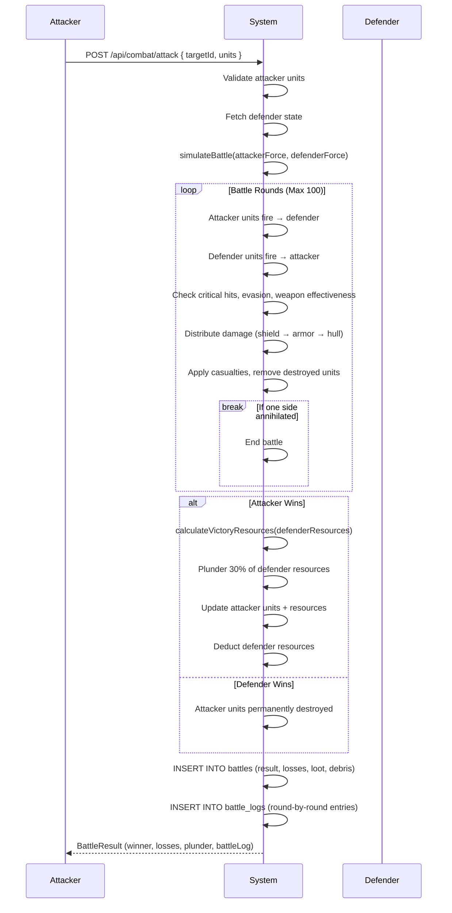

# Combat System

The combat system in Universe Empire Dominion is a multi-layered, round-based simulation featuring fleet battles, espionage, sabotage, and empire-level boss encounters. It spans server-side battle resolution, client-side combat prediction, and a progression-driven tuning layer that adapts battle profiles to the player's power level.

---

## Table of Contents

- [Overview](#overview)
- [Battle Mechanics](#battle-mechanics)
- [Damage Formula](#damage-formula)
- [Critical Hits and Evasion](#critical-hits-and-evasion)
- [Shield and Armor Interaction](#shield-and-armor-interaction)
- [Flange (Formation) System](#flange-formation-system)
- [Research Bonuses](#research-bonuses)
- [Commander Bonuses](#commander-bonuses)
- [Unit Stats and Types](#unit-stats-and-types)
- [Weapon Systems](#weapon-systems)
- [Defense Systems](#defense-systems)
- [Ship Combat Profiles](#ship-combat-profiles)
- [Planet Defense Platforms](#planet-defense-platforms)
- [Espionage System](#espionage-system)
- [Sabotage System](#sabotage-system)
- [Battle Reports and Logs](#battle-reports-and-logs)
- [Empire Combat (Bosses, Effects, Profiles)](#empire-combat-bosses-effects-profiles)
- [API Endpoints](#api-endpoints)
- [Database Schema](#database-schema)
- [Client-Side Combat Pages](#client-side-combat-pages)

---

## Overview

Combat operates across three layers:

1. **Server-side engine** — resolves battles deterministically using unit stats, research bonuses, and RNG.
2. **Client-side engine** — provides instant battle prediction and advanced ship-to-ship simulation with weapon-type interactions.
3. **Empire progression layer** — tunes battle parameters (rounds, plunder rate, retreat threshold) based on the player's combat level and tier.

Battles are initiated via the **attack** API or simulated client-side. The system supports PvP attacks, PvE encounters, espionage missions, and sabotage raids.

> **Source:** `server/combatEngine.ts` — server battle resolution
> **Source:** `client/src/lib/combatEngine.ts` — client ship-level simulation
> **Source:** `shared/config/empireCombatUniverseSystemsConfig.ts` — progression profiles

---

## Battle Mechanics

### Round-Based Resolution

Battles proceed in rounds. Each round, every surviving unit on both sides attacks a target on the opposing side.

**Server engine** (`server/combatEngine.ts`):
- Maximum rounds: configurable via `COMBAT_CONFIG.BATTLE_CONFIG.MAX_ROUNDS` (default: 100).
- Each individual unit attacks once per round.
- Targets are selected sequentially from the first available unit.
- Casualties are calculated proportionally to total damage dealt.
- If max rounds are reached without a winner, the attacker wins by default.

**Client engine** (`client/src/lib/combatEngine.ts`):
- Maximum turns: 10 (configurable via `maxTurns`).
- Target selection uses threat-based prioritization: `attack * (health / maxHealth)`.
- Ships are removed when hull reaches 0.
- Shield recharges 10% per turn.

**Client prediction** (`client/src/lib/combatSystem.ts`):
- Maximum rounds: 6.
- Damage variance: 0.8–1.2x per round.
- Losses are proportional to cumulative damage taken.

> **Source:** `server/combatEngine.ts:204-310` — `simulateBattle` function
> **Source:** `client/src/lib/combatEngine.ts:147-381` — `CombatEngine` class
> **Source:** `client/src/lib/combatSystem.ts:88-211` — `simulatePvPCombat` function
> **Source:** `client/src/lib/gameLogic.ts:24-128` — `simulateCombat` function

### Battle Modes

The `shared/config/combatConfig.ts` defines combat modes:

| Mode | Players | Max Units | Flange Bonus |
|------|---------|-----------|--------------|
| Solo PvE | 1 | 500 | 0% |
| Group PvE | 2–6 | 2000 | 15% |
| Solo PvP | 1 | 500 | 0% |
| Group PvP | 2–6 | 2000 | 25% |

**PvE Difficulty Modifiers:**

| Difficulty | Enemy HP | Enemy Damage | Loot |
|-----------|----------|-------------|------|
| Easy | 0.7x | 0.6x | 1.0x |
| Normal | 1.0x | 1.0x | 1.5x |
| Hard | 1.5x | 1.3x | 2.5x |
| Extreme | 2.5x | 2.0x | 5.0x |
| Nightmare | 4.0x | 3.0x | 10.0x |

> **Source:** `shared/config/combatConfig.ts:1-58` — mode definitions, PvE difficulty, PvP ranks

### Battle Profiles (Progression Layer)

Battle parameters are dynamically tuned based on the player's combat level. Two profiles exist:

| Parameter | PvE | PvP |
|-----------|-----|-----|
| Max Rounds | 8 | 6 |
| Rapid Fire Multiplier | 1.2 | 1.35 |
| Debris Field Rate | 25% | 30% |
| Plunder Rate | 35% | 40% |
| Retreat Threshold | 30% | 25% |
| Initiative Variance | 12% | 18% |
| Morale Swing Factor | 18% | 25% |
| Critical Impact Factor | 1.35 | 1.5 |

> **Source:** `shared/config/empireCombatUniverseSystemsConfig.ts:260-285` — `BATTLE_SYSTEM_PROFILES`

---

## Damage Formula

### Server-Side Damage

```
baseDamage = max(MINIMUM_DAMAGE, attackerAttack - defenderDefense * 0.5)
damage = baseDamage * variance(±20%)
if (isCritical) damage *= CRITICAL_MULTIPLIER
```

- `MINIMUM_DAMAGE`: 1 (guaranteed minimum damage).
- Variance: `(random - 0.5) * 0.4` applied as a multiplier (±20%).
- Critical multiplier: 1.5x (50% extra damage).

> **Source:** `server/combatEngine.ts:88-109` — `calculateDamage` function

### Client-Side Damage (CombatEngine)

```
evasionCheck: random(0-100) < defender.evasion → miss (0 damage)
baseDamage = baseAttack * accuracy(0.9–1.0) * weaponEffectiveness * variance(0.85–1.15)
shieldDamage = min(baseDamage, defender.shield)
remainingDamage = baseDamage - shieldDamage
armorDamage = min(remainingDamage * 0.5, defender.armor)
hullDamage = remainingDamage - armorDamage
```

> **Source:** `client/src/lib/combatEngine.ts:164-195` — `calculateDamage` method

### Client-Side Damage (CombatSystem)

```
attackerDamage = max(1, floor(totalOffense * random(0.8–1.2)))
defenderDamage = max(0, floor(totalOffense * random(0.8–1.2)))
```

Fleet stats aggregate unit stats multiplied by count and commander bonus multipliers.

> **Source:** `client/src/lib/combatSystem.ts:70-85` — `calculateFleetStats` function

### Client-Side Damage (gameLogic)

Shields absorb damage first. If `attack > currentShield`, excess damage passes to hull and shields collapse. If `attack <= currentShield`, shields absorb the hit entirely. Shields fully restore between rounds.

> **Source:** `client/src/lib/gameLogic.ts:24-81` — `simulateCombat` function

---

## Critical Hits and Evasion

### Critical Hits

| Source | Base Crit Chance | Crit Multiplier |
|--------|-----------------|-----------------|
| Server engine | 5% per unit per attack | 1.5x |
| Client CombatEngine | Per-weapon (2–15%) | Per-weapon (1.2–3.0x) |
| CombatConfig | 5% base | 1.5x |
| Progression layer | 4 + tier×0.5 + level×0.03 (capped 65%) | 125 + tier×4 |

### Evasion

| Source | Base Evasion |
|--------|-------------|
| Client CombatEngine | Per-ship (3–25%) |
| CombatConfig | 5 base |
| Progression layer | Derived from `speed * 0.22` |

The `WEAPON_EFFECTIVENESS` table in the client engine modifies damage based on weapon type vs armor type:

| Weapon \ Armor | Standard | Reinforced | Ceramic | Composite | Quantum |
|---------------|----------|------------|---------|-----------|---------|
| Laser | 1.0 | 0.8 | 1.2 | 0.9 | 0.7 |
| Plasma | 1.2 | 1.0 | 0.8 | 1.1 | 0.9 |
| Missile | 0.9 | 1.1 | 1.0 | 1.2 | 0.8 |
| Railgun | 1.3 | 1.0 | 0.9 | 1.0 | 1.1 |
| Ion | 0.8 | 0.9 | 1.1 | 0.7 | 1.3 |

> **Source:** `server/combatEngine.ts:30-36` — `BATTLE_CONFIG` critical constants
> **Source:** `client/src/lib/combatEngine.ts:139-145` — `WEAPON_EFFECTIVENESS` table
> **Source:** `shared/config/empireCombatUniverseSystemsConfig.ts:224-233` — progression sub-attributes

---

## Shield and Armor Interaction

The damage pipeline in the client engine:

1. **Evasion check** — if successful, attack misses entirely.
2. **Accuracy roll** — 90–100%.
3. **Weapon effectiveness** — multiplier based on weapon type vs armor type.
4. **Variance** — ±15% random factor.
5. **Damage distribution**:
   - Shields absorb first (up to remaining shield HP).
   - 50% of remaining damage goes to armor (up to armor HP).
   - Hull takes the rest.
6. **Shield recharge** — shields recover 10% of max shield at end of each turn.

> **Source:** `client/src/lib/combatEngine.ts:164-195` — damage distribution
> **Source:** `client/src/lib/combatEngine.ts:247` — shield recharge

---

## Flange (Formation) System

Formations provide tactical bonuses that modify offense and defense multipliers:

| Formation | Flank Bonus | Defense Mult | Offense Mult | Requirements |
|-----------|------------|-------------|-------------|-------------|
| Balanced | 1.0 | 1.0 | 1.0 | — |
| Aggressive | 1.5 | 0.8 | 1.4 | — |
| Defensive | 0.7 | 1.5 | 0.7 | — |
| Flanking | 1.8 | 0.6 | 1.8 | Position advantage |
| Pincer | 2.0 | 0.7 | 2.0 | Team coordination |
| Circle | 1.2 | 1.2 | 1.0 | — |
| Wedge | 1.6 | 0.9 | 1.6 | — |

> **Source:** `shared/config/combatConfig.ts:12-20` — flange definitions

---

## Research Bonuses

Research technologies provide per-level stat multipliers:

| Research | Bonus Per Level | Applies To |
|----------|----------------|------------|
| `weaponsTech` | +5% attack | Unit attack power |
| `shieldingTech` | +5% defense | Unit defense/shield |
| `armourTech` | +3% health | Unit hull HP |
| `combustionDrive` | +2% speed | Unit speed |
| `militaryTech` | +2% multiplier | Overall bonus multiplier |
| `defenseTech` | +2% multiplier | Defender bonus multiplier |

**Effective stat calculation:**
```
attack = baseAttack * bonusMultiplier * (1 + weaponsTechLevel * 0.05)
defense = baseDefense * bonusMultiplier * (1 + shieldingTechLevel * 0.05)
health = baseHealth * bonusMultiplier * (1 + armourTechLevel * 0.03)
```

The combat level for progression is derived from:
```
techSignal = weaponsTech + shieldingTech + armourTech + militaryTech + defenseTech
level = max(1, min(999, floor(1 + techSignal * 6 + shipyardLevel * 4)))
```

> **Source:** `server/combatEngine.ts:22-27` — `RESEARCH_BONUSES`
> **Source:** `server/combatEngine.ts:63-83` — `getUnitStats` function
> **Source:** `server/routes-combat.ts:46-55` — `toPlayerCombatLevel` function

---

## Commander Bonuses

Commanders provide class-based and stat-based combat multipliers:

### Class Bonuses

| Class | Offense | Defense |
|-------|---------|---------|
| Warrior | +20% | +15% |
| Scout | +10% | +5% |
| Industrialist | — | +25% |
| Scientist | +15% | — |

### Stat Bonuses

| Stat | Effect |
|------|--------|
| Warfare | +2% offense per point |
| Logistics | +2% defense per point |
| Engineering | +1% HP per point |

> **Source:** `client/src/lib/combatSystem.ts:38-67` — `getCommanderCombatBonus` function

---

## Unit Stats and Types

### Server-Side Unit Definitions

| Unit Type | Attack | Defense | Health | Speed |
|-----------|--------|---------|--------|-------|
| Light Fighter | 50 | 20 | 100 | 12 |
| Heavy Fighter | 80 | 40 | 150 | 10 |
| Small Cargo | 10 | 15 | 400 | 8 |
| Large Cargo | 5 | 10 | 800 | 5 |
| Espionage Probe | 1 | 5 | 50 | 20 |
| Battleship | 200 | 100 | 600 | 6 |
| Cruiser | 120 | 60 | 400 | 8 |
| Destroyer | 90 | 50 | 300 | 10 |
| Dreadnought | 300 | 150 | 1000 | 4 |
| Colonist | 5 | 5 | 50 | 3 |

> **Source:** `server/combatEngine.ts:8-19` — `UNIT_STATS`

### Client-Side Unit Data (OGame-style)

| Unit | Class | Structure | Shield | Attack | Cargo | Speed | Cost (M/C/D) |
|------|-------|-----------|--------|--------|-------|-------|--------------|
| Viper (Light Fighter) | Fighter | 4000 | 10 | 50 | 50 | 12500 | 3000/1000/0 |
| Cobra (Heavy Fighter) | Fighter | 10000 | 25 | 150 | 100 | 10000 | 6000/4000/0 |
| Wraith (Interceptor) | Fighter | 25000 | 50 | 400 | 0 | 15000 | 15000/10000/2000 |
| Hammerhead (Cruiser) | Capital | 27000 | 50 | 400 | 800 | 15000 | 20000/7000/2000 |
| Leviathan (Battleship) | Capital | 60000 | 200 | 1000 | 1500 | 10000 | 45000/15000/0 |
| Reaper (Battlecruiser) | Capital | 70000 | 400 | 700 | 750 | 10000 | 30000/40000/15000 |
| Obliterator (Destroyer) | Capital | 110000 | 500 | 2000 | 2000 | 5000 | 60000/50000/15000 |
| Devastator (Bomber) | Capital | 75000 | 500 | 1000 | 500 | 4000 | 50000/25000/15000 |
| Mothership | Super | 1500000 | 10000 | 5000 | 100000 | 2000 | 1M/500K/100K |
| Planet Killer (Death Star) | Super | 9000000 | 50000 | 200000 | 1000000 | 100 | 5M/4M/1M |
| Avatar (Titan Prometheus) | Titan | 25000000 | 1000000 | 5000000 | 500000 | 50 | 10M/8M/5M |
| Erebus (Titan Atlas) | Titan | 40000000 | 2000000 | 3000000 | 800000 | 40 | 12M/10M/4M |
| Ragnarok (Titan Hyperion) | Titan | 20000000 | 500000 | 8000000 | 200000 | 60 | 9M/7M/3M |
| Hermes (Small Cargo) | Civilian | 4000 | 10 | 5 | 5000 | 5000 | 2000/2000/0 |
| Hercules (Large Cargo) | Civilian | 12000 | 25 | 5 | 25000 | 7500 | 6000/6000/0 |
| Exodus (Colony Ship) | Civilian | 30000 | 100 | 50 | 7500 | 2500 | 10000/20000/10000 |
| Scavenger (Recycler) | Civilian | 16000 | 10 | 1 | 20000 | 2000 | 10000/6000/2000 |
| Seeker Drone (Espionage Probe) | Civilian | 1000 | 0 | 0 | 5 | 100000000 | 0/1000/0 |
| Space Marine | Troop | 100 | 5 | 10 | 0 | 0 | 100/50/0 |
| Exo-Trooper | Troop | 500 | 20 | 50 | 0 | 0 | 500/200/50 |
| Colonist | Troop | 50 | 0 | 0 | 0 | 0 | 50/50/0 |
| Hover Tank | Vehicle | 2000 | 100 | 200 | 0 | 50 | 2000/500/100 |
| Titan Mech | Vehicle | 10000 | 500 | 1000 | 0 | 20 | 10000/5000/1000 |

> **Source:** `client/src/lib/unitData.ts:30-251` — full unit catalog

---

## Weapon Systems

Weapons are defined with eight damage types and six mounting styles:

### Damage Types

| Type | Description |
|------|-------------|
| Kinetic | Railguns, mass drivers, projectiles |
| Energy | Lasers, plasma, beam weapons |
| Explosive | Missiles, torpedoes, bombs |
| Ionic | Ion cannons (drains shields) |
| Graviton | Spacetime-warping hull crackers |
| Nanite | Self-replicating damage swarms |
| EMP | Disables electronics/engines |
| Psionic | Rare alien-derived weapons |

### Weapon Mounts

Turret (360°), Broadside (fixed arc, high DPS), Spinal (ship-spine, extreme single-target), Missile Bay (guided munitions), Drone Bay (combat drones), Point Defense (intercepts missiles/drones).

### Weapon Catalog (selected)

| Weapon | Damage | RoF | Accuracy | Shield Pen | Armor Pen | Crit | Multiplier |
|--------|--------|-----|----------|------------|-----------|------|-----------|
| Light Cannon | 30 | 3 | 85% | 5% | 15% | 5% | 1.5x |
| Railgun | 120 | 1 | 78% | 10% | 45% | 8% | 2.0x |
| Laser Turret | 45 | 4 | 92% | 0% | 5% | 4% | 1.4x |
| Plasma Cannon | 150 | 1 | 80% | 20% | 60% | 10% | 2.2x |
| Torpedo Bank | 220 | 1 | 65% | 30% | 35% | 7% | 2.0x |
| Ion Cannon | 50 | 2 | 88% | 60% | 2% | 5% | 1.5x |
| Ion Disruptor Array | 120 | 1 | 82% | 80% | 0% | 6% | 1.8x |
| Graviton Battery | 500 | 1 | 60% | 100% | 50% | 5% | 2.5x |
| Nuclear Warhead | 800 | 1 | 55% | 50% | 60% | 10% | 3.0x |
| Particle Beam | 250 | 1 | 75% | 25% | 40% | 8% | 2.0x |
| Nanite Swarm Launcher | 180 | 1 | 72% | 5% | 70% | 8% | 2.0x |
| Psionic Disruptor | 300 | 1 | 65% | 50% | 20% | 15% | 2.5x |
| Point Defense Cannon | 15 | 8 | 95% | 0% | 5% | 2% | 1.2x |

Full weapon catalog includes 20+ systems across all categories.

> **Source:** `shared/config/weaponsAndDefenseConfig.ts:204-641` — `WEAPON_SYSTEMS` catalog

---

## Defense Systems

### Defense Types

Energy Shield, Deflector Shield, Phase Shield, Ionic Shield, Reflective Hull, Composite Armor, Reactive Armor.

### Defense Catalog (selected)

| Defense | Shield Type | HP | Recharge | DR | Resistances | Vulnerabilities |
|---------|------------|-----|----------|-----|-------------|----------------|
| Light Energy Shield | energy_shield | 200 | 20/round | 10% | Energy +20% | Ionic +50% |
| Medium Energy Shield | energy_shield | 500 | 15/round | 18% | Energy +25%, Explosive +10% | Ionic +40% |
| Heavy Energy Shield | energy_shield | 1500 | 10/round | 28% | Energy +30%, Explosive +20% | Ionic +35%, Graviton +30% |
| Deflector Shield | deflector_shield | 600 | 8/round | 30% | Kinetic +40%, Explosive +30% | Energy +30% |
| Ionic Counter-Shield | ionic_shield | 300 | 25/round | 15% | Ionic +80%, EMP +60% | Energy +20%, Kinetic +10% |
| Composite Armor | composite_armor | 1200 | 0 | 35% | Kinetic +40%, Explosive +35% | Energy +15%, Ionic +10% |
| Reactive Armor | reactive_armor | 800 | 0 | 40% | Explosive +50%, Kinetic +30% | Energy +20% |
| Reflective Hull | reflective_hull | 400 | 0 | 20% | Energy +50% | Kinetic +15%, Graviton +20% |
| Phase Variance Shield | phase_shield | 700 | 12/round | 25% | Energy +30%, Ionic +30%, Kinetic +15% | Graviton +40% |
| Planetary Shield Generator | energy_shield | 5000 | 50/round | 30% | Energy +20%, Explosive +20%, Kinetic +15% | Graviton +50%, Ionic +20% |

> **Source:** `shared/config/weaponsAndDefenseConfig.ts:647-788` — `DEFENSE_SYSTEMS` catalog

---

## Ship Combat Profiles

Each ship type has a combat profile defining hull class, hit points, shield points, armor points, and weapon/defense loadouts.

| Ship | Class | Hull HP | Shield | Armor | Primary Weapons | Defense Systems |
|------|-------|---------|--------|-------|----------------|----------------|
| Light Fighter | Fighter | 100 | 20 | 15 | Light Cannon | Light Shield |
| Heavy Fighter | Fighter | 150 | 40 | 30 | Heavy Laser, Missile Launcher | Light Shield, Composite Armor |
| Corvette | Escort | 200 | 60 | 40 | Laser Turret, Missile Launcher | Light Shield, Composite Armor |
| Frigate | Escort | 300 | 80 | 60 | Heavy Laser, Ion Cannon | Medium Shield, Deflector Shield |
| Destroyer | Escort | 300 | 50 | 100 | Railgun, Missile Launcher | Deflector Shield, Composite Armor |
| Cruiser | Capital | 400 | 120 | 100 | Plasma Cannon, Ion Cannon | Medium Shield, Composite Armor |
| Battleship | Capital | 600 | 200 | 200 | Railgun, Plasma Cannon, Torpedo Bank | Medium Shield, Deflector Shield, Composite Armor |
| Dreadnought | Capital | 1000 | 300 | 350 | Railgun, Plasma Cannon, Torpedo Bank, Phased Pulse Laser | Heavy Shield, Composite Armor, Reactive Armor |
| Command Ship | Mothership | 5000 | 1000 | 800 | Particle Beam, Ion Disruptor, Plasma Cannon | Heavy Shield, Ionic Shield, Composite Armor, Reactive Armor |
| Mobile Fortress | Mothership | 8000 | 2000 | 2000 | Graviton Battery, Nuclear Warhead, Particle Beam | Heavy Shield, Phase Shield, Composite Armor, Reflective Hull |
| Siege Ship | Mothership | 4000 | 800 | 600 | Mass Driver, Interplanetary Missile, Torpedo Bank | Medium Shield, Composite Armor |

> **Source:** `shared/config/weaponsAndDefenseConfig.ts:794-987` — `SHIP_COMBAT_PROFILES` catalog

---

## Planet Defense Platforms

| Platform | Category | HP | Weapons | Defense Systems |
|----------|----------|-----|---------|----------------|
| Missile Battery | missile_platform | 200 | Missile Launcher | — |
| Laser Turret Platform | gun_platform | 300 | Laser Turret | Light Shield |
| Gauss Cannon Battery | gun_platform | 500 | Gauss Cannon | — |
| Ion Cannon Battery | gun_platform | 400 | Ion Cannon | Ionic Shield |
| Plasma Cannon Battery | gun_platform | 600 | Plasma Cannon | Deflector Shield |
| Shield Generator | shield_projector | 1000 | — | Planetary Shield Generator |
| Point Defense Grid | point_defense | 250 | Point Defense Cannon, Flak Battery | — |
| Mass Driver Station | orbital_defense | 1500 | Mass Driver | Composite Armor |
| Orbital Mine Field | mine_field | 50 | — | — |
| Interplanetary Missile Silo | missile_platform | 800 | Interplanetary Missile | Composite Armor |

> **Source:** `shared/config/weaponsAndDefenseConfig.ts:993-1114` — `PLANET_DEFENSE_PLATFORMS`

---

## Espionage System

Espionage gathers intel before an attack. Intelligence levels determine what information is revealed.

### Intel Levels

| Level Difference | Information Revealed |
|-----------------|---------------------|
| ≥ 1 | Resources + Fleet composition |
| ≥ 3 | Resources + Fleet + Defense structures |
| ≥ 5 | Resources + Fleet + Defense + Buildings |
| ≥ 7 | Full report including Tech levels |

### Mechanics

- **Level difference** = `myEspionageLevel + sqrt(probeCount) - enemyEspionageLevel`
- Higher probe counts increase effective espionage level but also raise counter-espionage detection chance.
- **Counter-espionage**: 2% chance per probe sent (capped at 100%).

> **Source:** `client/src/lib/gameLogic.ts:130-179` — `simulateEspionage` function

---

## Sabotage System

Sabotage missions disrupt enemy infrastructure using specialized agents.

### Mechanics

- **Success chance**: `min(0.9, saboteurs * 0.1)` — 10% per saboteur, capped at 90%.
- **Success outcome**: Temporarily disables target systems (e.g., energy grid offline for 1 hour).
- **Failure outcome**: Saboteurs detected and neutralized by security forces.

### Targets

Mines, power plants, shipyards, and other production/infrastructure buildings.

> **Source:** `client/src/lib/gameLogic.ts:181-190` — `simulateSabotage` function

---

## Battle Reports and Logs

### Battle Report Contents

After every engagement, a report is generated containing:

- **Rounds fought** — duration of the battle.
- **Losses** — total unit losses for both sides (per unit type).
- **Debris field** — wreckage created (Metal/Crystal) that can be harvested by Recyclers.
- **Loot** — resources plundered (up to 30–40% of defender's resources depending on battle profile).

### Battle Report Classification (OGame-style taxonomy)

The system classifies battles along four axes:

**Report Type** (mission class):
- `attack`, `raid`, `espionage`, `colonization`, `moon_attack`, `starbase_attack`, `mothership_strike`, `expedition`, `alliance_war`, `planetary_assault`

**Report SubType** (specific breakdown):
- Fleet battles, orbital bombardment, ground assault, convoy intercept, resource raids, piracy, spy outcomes, moon destruction, blitz assault, etc.

**Report Class** (strategic significance):
- `decisive` (100% losses), `major` (>50%), `moderate`, `minor`, `pyrrhic` (winner suffers catastrophic losses), `tactical`, `draw`

**Report SubClass** (combat context):
- `deep_space`, `planetary_orbit`, `asteroid_field`, `nebula`, `ambush`, `pitched_battle`, `overwhelming_force`, `close_fought`, `mothership_duel`, `capital_clash`, etc.

### Battle Report Metadata

Each battle report includes detailed metadata:
- Weapons used by attacker and defender.
- Planet defense platforms engaged.
- Whether mothership was involved.
- Planetary shield status.
- Weapon damage breakdown by weapon ID.
- Total shields stripped and armor damage dealt.

> **Source:** `shared/config/weaponsAndDefenseConfig.ts:1121-1340` — `BattleReportType`, `classifyBattleReport` function

### Battle Log Database

Individual round-by-round logs are stored in the `battle_logs` table:

- `battleId` — reference to parent battle record.
- `round` — round number.
- `attackerDamageDealt` / `defenderDamageDealt` — damage per round.
- `unitsDestroyed` — units lost this round.
- `log` — text description of the round.

> **Source:** `shared/schema.ts:538-556` — `battleLogs` table definition

---

## Empire Combat (Bosses, Effects, Profiles)

### Combat Effects Library

Six combat effects that can be applied during battles:

| Effect | Type | Category | Duration | Stack | Magnitude | Applies To |
|--------|------|----------|----------|-------|-----------|------------|
| Command Overclock | Buff | Damage | 3 turns | 2 | +18% | Ally |
| Reactive Shields | Buff | Mitigation | 2 turns | 1 | +25% | Self |
| Supply Surge | Buff | Sustain | 4 turns | 1 | +20% | Ally |
| Target Lock | Debuff | Control | 2 turns | 3 | -12% | Enemy |
| Armor Fracture | Debuff | Mitigation | 3 turns | 2 | -16% | Enemy |
| Engine Jam | Debuff | Control | 2 turns | 1 | -22% | Enemy |

> **Source:** `shared/config/empireCombatUniverseSystemsConfig.ts:251-258` — `COMBAT_EFFECT_LIBRARY`

### Event Bosses

| Boss | Tier | Level | Stats Source | Effects | Rewards (M/C/D/XP) |
|------|------|-------|-------------|---------|---------------------|
| Void Dreadnought | 35 | 350 | Mothership at L350 | Engine Jam, Armor Fracture | 300K/220K/150K/180K XP |
| Emperor Flagship | 55 | 550 | Mothership at L550 | Reactive Shields, Command Overclock | 700K/500K/380K/400K XP |
| Omega Core Prime | 85 | 850 | Mothership at L850 | Target Lock, Engine Jam, Reactive Shields | 1.4M/1.1M/900K/900K XP |

Boss stats are generated dynamically using `buildProgressionSnapshot('mothership', level)`.

> **Source:** `shared/config/empireCombatUniverseSystemsConfig.ts:287-321` — `EVENT_BOSSES`

### NPC World Templates

| World | Tier | Level | Defense | Economy | Loot Multiplier |
|-------|------|-------|---------|---------|----------------|
| Iron Bastion | 28 | 280 | 4200 | 2300 | 1.15x |
| Elysian Dome | 47 | 470 | 7200 | 5100 | 1.35x |
| Obsidian Citadel | 76 | 760 | 11800 | 8900 | 1.65x |

> **Source:** `shared/config/empireCombatUniverseSystemsConfig.ts:323-354` — `NPC_WORLD_TEMPLATES`

### Universe Event Templates

| Event | Type | Tier | Duration | Mode | Rewards (Credits/XP) |
|-------|------|------|----------|------|---------------------|
| Cosmic Surge | cosmic | 20 | 180 min | mixed | 120K / 45K XP |
| NPC World Incursion | npcWorld | 40 | 240 min | PvE | 300K / 120K XP |
| Empire Boss Hunt | boss | 60 | 300 min | PvE | 800K / 350K XP |
| Warfront Season | allianceWar | 50 | 1440 min | PvP | 500K / 210K XP |

> **Source:** `shared/config/empireCombatUniverseSystemsConfig.ts:356-401` — `UNIVERSE_EVENT_TEMPLATES`

### Progression System

The progression system tracks 5 entity tracks: `starship`, `mothership`, `unit`, `defense`, `commander`.

- **99 tiers** across **999 levels**.
- Each tier spans 10 levels.
- Stats scale with `levelFactor = 1 + (level-1) * 0.024` and `tierFactor = 1 + (tier-1) * 0.065`.
- Combat attributes (kinetic, energy, explosive, shield, armor, evasion, targeting, command) are derived from core stats.
- Sub-attributes (crit chance, crit damage, block chance, penetration, resistance, regeneration, morale impact, disruption) are computed from attributes.

> **Source:** `shared/config/empireCombatUniverseSystemsConfig.ts:133-249` — rank/tier system, `buildProgressionSnapshot`

---

## API Endpoints

### Combat Routes (`server/routes-combat.ts`)

| Method | Endpoint | Description |
|--------|----------|-------------|
| `GET` | `/api/combat/stats` | Returns player combat stats: fleet power, unit composition, research bonuses, combat level, progression snapshot, battle profile, and suggested effects. |
| `POST` | `/api/combat/attack` | Attacks another player. Body: `{ targetId, units }`. Returns battle result, plunder, new unit counts, and updated resources. |
| `POST` | `/api/combat/garrison` | Assign units to defend a location. Body: `{ units }`. |
| `POST` | `/api/combat/defense/activate` | Activate planetary defenses. Body: `{ unitType, quantity }`. Returns effective defense with building bonus. |
| `GET` | `/api/combat/battle-history` | Returns last 50 battles for the player with normalized results (victory/defeat/draw), casualties, and plunder. |

### Empire Combat Routes (`server/routes-empire-combat-universe.ts`)

| Method | Endpoint | Description |
|--------|----------|-------------|
| `GET` | `/api/systems/progression-combat/meta` | Returns combat modes, effects library, and event system summary. |
| `GET` | `/api/systems/progression-combat/snapshot` | Returns progression snapshot for a track and level. Query: `?track=commander&level=100`. |
| `GET` | `/api/systems/progression-combat/catalog/:track` | Returns full progression catalog for a track (up to 999 entries). |
| `GET` | `/api/systems/progression-combat/tiers` | Returns tier and level matrix. |
| `GET` | `/api/systems/events` | Returns event bosses, NPC worlds, and universe event templates. |

> **Source:** `server/routes-combat.ts:61-543` — combat route handlers
> **Source:** `server/routes-empire-combat-universe.ts:34-89` — empire combat route handlers

---

## Database Schema

### `battles` Table

Stores completed battle records.

| Column | Type | Description |
|--------|------|-------------|
| `id` | varchar (PK) | Battle ID |
| `attackerId` | varchar (FK → users) | Attacking player |
| `defenderId` | varchar (FK → users) | Defending player |
| `type` | varchar | Mission type: `"raid"`, `"attack"`, `"spy"`, `"sabotage"` |
| `status` | varchar | `"pending"`, `"completed"`, `"failed"` |
| `attackerCoordinates` | varchar | Origin coordinates |
| `defenderCoordinates` | varchar | Target coordinates |
| `winner` | varchar | `"attacker"`, `"defender"`, `"draw"`, `"spy_success"`, `"spy_failed"` |
| `attackerFleet` | jsonb | `{ unitId: count }` — fleet sent |
| `defenderFleet` | jsonb | `{ unitId: count }` — defender fleet at battle start |
| `attackerLosses` | jsonb | `{ unitId: count }` — attacker casualties |
| `defenderLosses` | jsonb | `{ unitId: count }` — defender casualties |
| `loot` | jsonb | `{ metal, crystal, deuterium }` — resources plundered |
| `debris` | jsonb | `{ metal, crystal }` — wreckage created |
| `rounds` | integer | Number of rounds fought |
| `createdAt` | timestamp | Battle creation time |
| `completedAt` | timestamp | Battle completion time |

> **Source:** `shared/schema.ts:505-535` — `battles` table

### `battle_logs` Table

Stores round-by-round battle log entries.

| Column | Type | Description |
|--------|------|-------------|
| `id` | varchar (PK) | Log entry ID |
| `battleId` | varchar (FK → battles) | Parent battle reference |
| `round` | integer | Round number |
| `attackerDamageDealt` | integer | Attacker damage this round |
| `defenderDamageDealt` | integer | Defender damage this round |
| `unitsDestroyed` | jsonb | Units lost this round |
| `log` | text | Text description of the round |
| `timestamp` | timestamp | Log entry creation time |

> **Source:** `shared/schema.ts:538-556` — `battleLogs` table

---

## Client-Side Combat Pages

### Combat Page (`client/src/pages/Combat.tsx`)

The main combat interface with three tabs:

1. **Attack Tab** — Fleet selection with sliders for each unit type, target player ID input, attack info sidebar showing selected units, suggested effects, and available profiles.
2. **Defend Tab** — Passive defense configuration showing current defense bonus from shields research.
3. **History Tab** — List of recent battles with victory/defeat badges, casualties, and plunder amounts.

**Key features:**
- Real-time combat stats display (attack power, defense bonus, total fleet, victories).
- Commander progression snapshot (level, tier, rank, title).
- Live battle profile display (mode, max rounds, plunder rate, retreat threshold).
- Battle result overlay showing rounds fought and resources plundered.

> **Source:** `client/src/pages/Combat.tsx:1-443` — Combat page component

### Battle Logs Page (`client/src/pages/BattleLogs.tsx`)

Dedicated battle log viewer with five filter tabs:

1. **All Battles** — Complete battle history.
2. **Attacks** — Battles where player was the attacker.
3. **Raids** — Resource-focused raid missions.
4. **Defenses** — Battles where player was the defender.
5. **Espionage** — Spy mission outcomes.

**Key features:**
- Summary statistics: total battles logged, victory rate, average casualties, total plunder.
- Combat review doctrine tips.
- Individual battle cards showing opponent, timestamp, rounds, role, casualties, loot, and battle type.

> **Source:** `client/src/pages/BattleLogs.tsx:1-206` — Battle Logs page component

---

## Mermaid: Combat Flow


