# Entity Relationship Diagram (ERD): Xenoberage

## Database Configuration

- **Dialect:** PostgreSQL
- **ORM:** Drizzle ORM with Zod validation
- **Migrations:** `./migrations`
- **Schema File:** `shared/schema.ts`

> **Source:** `drizzle.config.ts` - Database configuration
> **Source:** `shared/schema.ts` - Full database schema (2020 lines, 60+ tables)

---

## Overview

The database contains **60+ tables** organized into the following domains:

1. **Authentication & Users** (2 tables)
2. **Player State & Progression** (1 table)
3. **Geography & Worldbuilding** (5 tables)
4. **Military & Combat** (8 tables)
5. **Army System** (3 tables)
6. **Research & Technology** (5 tables)
7. **Economy & Trading** (8 tables)
8. **Social & Guilds** (8 tables)
9. **Story & Campaign** (3 tables)
10. **NPC & Factions** (3 tables)
11. **Relics & Items** (4 tables)
12. **PvE Content** (7 tables)
13. **Empire & Progression** (4 tables)
14. **Durability System** (4 tables)
15. **OGame Compendium** (2 tables)
16. **Miscellaneous** (3 tables)

---

## 1. Authentication & Users

### `sessions`
Session storage for Replit Auth.

| Column | Type | Notes |
|--------|------|-------|
| sid | varchar (PK) | Session ID |
| sess | jsonb | Session data |
| expire | timestamp | Expiration time |

> Index: `IDX_session_expire` on `expire`

### `users`
Core user accounts.

| Column | Type | Notes |
|--------|------|-------|
| id | varchar (PK) | `gen_random_uuid()` |
| username | varchar | Unique |
| passwordHash | varchar | |
| email | varchar | Unique |
| firstName | varchar | |
| lastName | varchar | |
| profileImageUrl | varchar | |
| createdAt | timestamp | |
| updatedAt | timestamp | |

---

## 2. Player State & Progression

### `player_states`
Master player game state - stores all progression data as JSON columns.

| Column | Type | Notes |
|--------|------|-------|
| id | varchar (PK) | |
| userId | varchar (FK->users) | CASCADE delete |
| setupComplete | boolean | |
| planetName | varchar | Default "New Colony" |
| coordinates | varchar | Default "[1:1:1]" |
| knownPlanets | jsonb | Array of known planet IDs |
| travelState | jsonb | Active routes, wormholes |
| travelLog | jsonb | Movement history |
| resources | jsonb | `{metal, crystal, deuterium, energy}` |
| buildings | jsonb | Building levels |
| orbitalBuildings | jsonb | Orbital structures |
| research | jsonb | Tech levels |
| researchQueue | jsonb | Queued research items |
| researchHistory | jsonb | Completed research |
| activeResearch | jsonb | Currently researching |
| researchBonuses | jsonb | Active bonuses |
| researchModifiers | jsonb | Tech/gov modifiers |
| researchLab | jsonb | Current lab config |
| availableLabs | jsonb | Accessible labs |
| turnsData | jsonb | Turn generation tracking |
| researchXP | jsonb | XP and discovery tracking |
| units | jsonb | Unit counts |
| commander | jsonb | Commander data |
| government | jsonb | Government type |
| artifacts | jsonb | Collected artifacts |
| cronJobs | jsonb | Scheduled tasks |
| empireLevel | integer | 1-999 |
| empireExperience | bigint | |
| tier | integer | 1-21 |
| tierExperience | bigint | |
| prestigeLevel | integer | |
| prestigeBonus | jsonb | Resource/XP/research multipliers |
| tierBonuses | jsonb | |
| kardashevProgress | jsonb | `{metal, crystal, deuterium, research}` |
| totalTurns | integer | |
| currentTurns | integer | |
| lastTurnUpdate | timestamp | |
| lastResourceUpdate | timestamp | |

---

## 3. Geography & Worldbuilding

### `continents`
| Column | Type | Notes |
|--------|------|-------|
| id | varchar (PK) | |
| continentName | varchar | |
| areaSqkm | real | |

### `countries`
| Column | Type | Notes |
|--------|------|-------|
| id | varchar (PK) | |
| continentId | varchar (FK) | CASCADE |
| countryName | varchar | |
| countryType | varchar | |
| ownerPlayerId | varchar (FK->users) | SET NULL |

### `territories`
| Column | Type | Notes |
|--------|------|-------|
| id | varchar (PK) | |
| countryId | varchar (FK) | CASCADE |
| territoryName | varchar | |
| territoryType | varchar | |
| areaSqkm | real | |
| controlledByPlayerId | varchar (FK->users) | SET NULL |

### `resource_fields`
| Column | Type | Notes |
|--------|------|-------|
| id | varchar (PK) | |
| territoryId | varchar (FK) | CASCADE |
| fieldName | varchar | |
| fieldType | varchar | |
| fieldSize | varchar | |
| metalPerHour | real | |
| crystalPerHour | real | |
| deuteriumPerHour | real | |
| maxExtractionCapacity | integer | Default 100 |
| depletionPercent | integer | |
| isDepleted | boolean | |
| minedByPlayerId | varchar (FK->users) | SET NULL |
| totalMetalExtracted | real | |
| totalCrystalExtracted | real | |
| totalDeuteriumExtracted | real | |

### `player_colonies`
| Column | Type | Notes |
|--------|------|-------|
| id | varchar (PK) | |
| playerId | varchar (FK->users) | CASCADE |
| planetId | integer | |
| colonyName | varchar | |
| colonyType | varchar | |
| colonyLevel | integer | |
| population | integer | |

---

## 4. Military & Combat

### `missions`
Active fleet movements (attack, transport, espionage, colonize).

| Column | Type | Notes |
|--------|------|-------|
| id | varchar (PK) | |
| userId | varchar (FK->users) | CASCADE |
| type | varchar | "attack", "transport", "espionage", etc |
| status | varchar | "outbound", "return", "completed" |
| target | varchar | |
| origin | varchar | |
| units | jsonb | Fleet composition |
| cargo | jsonb | Resources transported |
| departureTime | timestamp | |
| arrivalTime | timestamp | |
| returnTime | timestamp | |
| processed | boolean | |

### `battles`
Combat records between players.

| Column | Type | Notes |
|--------|------|-------|
| id | varchar (PK) | |
| attackerId | varchar (FK->users) | |
| defenderId | varchar (FK->users) | |
| type | varchar | "raid", "attack", "spy", "sabotage" |
| status | varchar | "pending", "completed", "failed" |
| attackerCoordinates | varchar | |
| defenderCoordinates | varchar | |
| winner | varchar | "attacker", "defender", "draw" |
| attackerFleet | jsonb | |
| defenderFleet | jsonb | |
| attackerLosses | jsonb | `{unitId: count}` |
| defenderLosses | jsonb | |
| loot | jsonb | `{metal, crystal, deuterium}` |
| debris | jsonb | `{metal, crystal}` |
| rounds | integer | |

### `battle_logs`
Round-by-round combat details.

| Column | Type | Notes |
|--------|------|-------|
| id | varchar (PK) | |
| battleId | varchar (FK->battles) | CASCADE |
| round | integer | |
| attackerDamageDealt | integer | |
| defenderDamageDealt | integer | |
| unitsDestroyed | jsonb | |
| log | text | |

### `combat_stats`
Player combat performance tracking.

| Column | Type | Notes |
|--------|------|-------|
| id | varchar (PK) | |
| playerId | varchar (FK->users) | CASCADE |
| totalBattles | integer | |
| wins | integer | |
| losses | integer | |
| draws | integer | |
| raidParticipations | integer | |
| raidVictories | integer | |
| unitsDestroyed | integer | |
| unitsLost | integer | |
| combatRating | integer | Default 1000 |
| raidRating | integer | Default 1000 |

---

## 5. Army System

### `troops`
Individual troops with full stat blocks.

| Column | Type | Notes |
|--------|------|-------|
| id | varchar (PK) | |
| userId | varchar (FK->users) | CASCADE |
| name | varchar | |
| troopType | varchar | "infantry", "cavalry", "mage", etc |
| troopClass | varchar | "warrior", "knight", "berserker", etc |
| rank | varchar | "recruit" through "general" |
| title | varchar | |
| health / maxHealth | integer | |
| attack / defense / speed | integer | |
| morale | integer | |
| substats | jsonb | critChance, critDamage, armor, etc |
| weaponType / armorType | varchar | |
| specialAbility | varchar | |
| squadId | varchar | |
| position | varchar | "front", "middle", "back" |
| status | varchar | "active", "wounded", "dead", etc |
| loyaltyPercent | integer | |
| experiencePoints | integer | |

### `squads`
Groups of troops.

| Column | Type | Notes |
|--------|------|-------|
| id | varchar (PK) | |
| userId | varchar (FK->users) | |
| name | varchar | |
| squadType | varchar | "strike", "defense", "balanced", "elite" |
| commanderId | varchar (FK->troops) | |
| morale | integer | |
| combatExperience | integer | |
| victoriesCount | integer | |

---

## 6. Research & Technology

### `research_areas`
Top-level research categories.

| Column | Type | Notes |
|--------|------|-------|
| id | varchar (PK) | |
| areaName | varchar | |
| description | text | |

### `research_subcategories`
Sub-divisions within areas.

| Column | Type | Notes |
|--------|------|-------|
| id | varchar (PK) | |
| areaId | varchar (FK->research_areas) | |
| subcategoryName | varchar | |

### `research_technologies`
Individual technologies.

| Column | Type | Notes |
|--------|------|-------|
| id | varchar (PK) | |
| subcategoryId | varchar (FK) | |
| techName | varchar | |
| description | text | |
| requirements | jsonb | |
| effects | jsonb | |

### `player_research_progress`
Player's research completion status.

| Column | Type | Notes |
|--------|------|-------|
| id | varchar (PK) | |
| userId | varchar (FK->users) | CASCADE |
| technologyId | varchar (FK) | |
| status | varchar | |
| progress | integer | |

### `queue_items`
Construction/research/build queue.

| Column | Type | Notes |
|--------|------|-------|
| id | varchar (PK) | |
| userId | varchar (FK->users) | CASCADE |
| type | varchar | "building", "research", "unit" |
| itemId | varchar | |
| itemName | varchar | |
| amount | integer | |
| startTime / endTime | timestamp | |

---

## 7. Economy & Trading

### `marketOrders`
Global market buy/sell orders.

| Column | Type | Notes |
|--------|------|-------|
| id | varchar (PK) | |
| userId | varchar (FK->users) | CASCADE |
| type | varchar | "buy" or "sell" |
| resource | varchar | "metal", "crystal", "deuterium" |
| amount | integer | |
| pricePerUnit | real | |
| status | varchar | "active", "completed", "cancelled" |

### `auctionListings`
Player-to-player auction house.

| Column | Type | Notes |
|--------|------|-------|
| id | varchar (PK) | |
| sellerId | varchar (FK->users) | |
| sellerName | varchar | |
| itemType | varchar | "equipment", "material", etc |
| itemId | varchar | |
| itemName | varchar | |
| itemRarity | varchar | "common" through "legendary" |
| quantity | integer | |
| startingPrice | integer | |
| buyoutPrice | integer | |
| currentBid | integer | |
| bidIncrement | integer | |
| currentBidderId | varchar (FK->users) | SET NULL |
| bidCount | integer | |
| duration | integer | Hours |
| expiresAt | timestamp | |
| status | varchar | "active", "sold", "expired", "cancelled" |

### `auctionBids`
Bid history for auctions.

| Column | Type | Notes |
|--------|------|-------|
| id | varchar (PK) | |
| auctionId | varchar (FK->auctionListings) | CASCADE |
| bidderId | varchar (FK->users) | CASCADE |
| bidderName | varchar | |
| bidAmount | integer | |

### `tradeOffers`
Direct player-to-player trades.

| Column | Type | Notes |
|--------|------|-------|
| id | varchar (PK) | |
| senderId / receiverId | varchar (FK->users) | |
| senderName / receiverName | varchar | |
| offerMetal / offerCrystal / offerDeuterium | integer | |
| offerItems | jsonb | |
| requestMetal / requestCrystal / requestDeuterium | integer | |
| requestItems | jsonb | |
| message | text | |
| status | varchar | "pending" through "expired" |
| senderMessageId / receiverMessageId | varchar | Mail integration |
| counterOfferId / originalOfferId | varchar | |
| expiresAt | timestamp | |

### `tradeHistory`
Completed trade log.

| Column | Type | Notes |
|--------|------|-------|
| id | varchar (PK) | |
| tradeOfferId | varchar | |
| senderId / receiverId | varchar | |
| senderName / receiverName | varchar | |
| senderGave / receiverGave | jsonb | |
| result | varchar | |

### `playerCurrency`
Three-tier currency balances.

| Column | Type | Notes |
|--------|------|-------|
| id | varchar (PK) | |
| userId | varchar (FK->users) | CASCADE |
| silver / gold / platinum | bigint | |
| silverEarned / silverSpent | bigint | |
| goldEarned / goldSpent | bigint | |
| platinumEarned / platinumSpent | bigint | |

### `currencyTransactions`
Currency transaction log.

| Column | Type | Notes |
|--------|------|-------|
| id | varchar (PK) | |
| userId | varchar (FK->users) | CASCADE |
| currencyType | varchar | |
| amount | bigint | Positive=income, negative=expense |
| reason | varchar | |
| relatedId | varchar | |
| balanceBefore / balanceAfter | bigint | |

### `bankAccounts`
Player banking with interest.

| Column | Type | Notes |
|--------|------|-------|
| id | varchar (PK) | |
| userId | varchar (FK->users) | CASCADE |
| accountType | varchar | "standard", "savings", "vault" |
| accountBalance | bigint | |
| interestRate | real | Default 5% |
| lastInterestPayment | timestamp | |
| totalInterestEarned | bigint | |
| maxWithdrawal / maxDeposit | bigint | |

### `bankTransactions`
Bank transaction history.

| Column | Type | Notes |
|--------|------|-------|
| id | varchar (PK) | |
| userId | varchar (FK->users) | |
| accountId | varchar (FK->bankAccounts) | CASCADE |
| transactionType | varchar | "deposit", "withdrawal", "interest", etc |
| amount | bigint | |
| balanceBefore / balanceAfter | bigint | |

---

## 8. Social & Guilds

### `messages`
Player communications, battle reports, system messages.

| Column | Type | Notes |
|--------|------|-------|
| id | varchar (PK) | |
| fromUserId / toUserId | varchar (FK->users) | |
| from / to | varchar | Display names |
| subject | varchar | |
| body | text | |
| type | varchar | "player", "combat", "espionage", "system" |
| read | boolean | |
| battleReport | jsonb | |
| espionageReport | jsonb | |

### `alliances`
Player alliances (1-50 members).

| Column | Type | Notes |
|--------|------|-------|
| id | varchar (PK) | |
| name | varchar | Unique |
| tag | varchar(10) | Unique |
| description | text | |
| announcement | text | |
| resources | jsonb | Shared treasury |

### `allianceMembers`
| Column | Type | Notes |
|--------|------|-------|
| id | varchar (PK) | |
| allianceId | varchar (FK->alliances) | CASCADE |
| userId | varchar (FK->users) | CASCADE |
| rank | varchar | "leader", "officer", "member", "recruit" |
| points | integer | |

### `guilds`
Enhanced player organizations.

| Column | Type | Notes |
|--------|------|-------|
| id | varchar (PK) | |
| name | varchar | |
| description | text | |
| emblem | varchar | URL |
| leaderId | varchar (FK->users) | |
| coLeaders | jsonb | |
| level | integer | |
| totalMembers | integer | |
| treasury | integer | |
| influence | integer | |
| maxMembers | integer | Default 100 |
| isRecruiting | boolean | |
| roles | jsonb | Custom roles |
| permissions | jsonb | |

### `guildMembers`
| Column | Type | Notes |
|--------|------|-------|
| id | varchar (PK) | |
| guildId | varchar (FK->guilds) | CASCADE |
| playerId | varchar (FK->users) | CASCADE |
| role | varchar | "leader", "officer", "member" |
| contributedCurrency | integer | |
| contributedResearch | integer | |

### `friends`
Social system (50 max per player).

| Column | Type | Notes |
|--------|------|-------|
| id | varchar (PK) | |
| playerId / friendId | varchar (FK->users) | |
| friendshipStatus | varchar | "pending", "accepted", "blocked" |
| nickname | varchar | |
| notes | text | |
| isOnline | boolean | |
| lastSeen | timestamp | |
| isFavorite | boolean | |

### `friendRequests`
| Column | Type | Notes |
|--------|------|-------|
| id | varchar (PK) | |
| senderId / receiverId | varchar (FK->users) | |
| message | text | |
| status | varchar | "pending", "accepted", "rejected", "expired" |
| expiresAt | timestamp | |

### `teams`
6-player squads for raids.

| Column | Type | Notes |
|--------|------|-------|
| id | varchar (PK) | |
| guildId | varchar (FK->guilds) | |
| name | varchar | |
| leaderId | varchar (FK->users) | |
| members | jsonb | Array of player IDs |
| maxMembers | integer | Default 6 |
| totalRaids | integer | |
| winsCount | integer | |
| level | integer | |

---

## 9. Story & Campaign

### `storyCampaigns`
Player campaign progression.

| Column | Type | Notes |
|--------|------|-------|
| id | varchar (PK) | |
| playerId | varchar (FK->users) | CASCADE |
| currentAct | integer | |
| currentChapter | integer | |
| completedActs | integer | |
| isCompleted | boolean | |
| storyProgress | real | 0-100% |
| totalXpEarned | integer | |
| campaignState | jsonb | |
| npcsEncountered | jsonb | |
| completedMissions | jsonb | |

### `storyMissions`
Individual missions within chapters.

| Column | Type | Notes |
|--------|------|-------|
| id | varchar (PK) | |
| playerId | varchar (FK->users) | |
| campaignId | varchar (FK->storyCampaigns) | CASCADE |
| act / chapter | integer | |
| missionType | varchar | "main", "side", "optional" |
| title | varchar | |
| description | text | |
| lore | text | |
| difficulty | integer | |
| npcName / npcRole / npcTrait | varchar | |
| objectives | jsonb | |
| rewardXp / rewardMetal / rewardCrystal / rewardDeuterium | integer | |
| rewardBadge | varchar | |
| rewardItems | jsonb | |
| isCompleted | boolean | |

### `achievements`
Player achievement tracking.

| Column | Type | Notes |
|--------|------|-------|
| id | varchar (PK) | |
| playerId | varchar (FK->users) | CASCADE |
| achievementId | varchar | |
| name | varchar | |
| description | text | |
| category | varchar | "story", "combat", "economic", "exploration" |
| progress / target | integer | |
| isCompleted | boolean | |
| rewardXp | integer | |
| rewardBadge | varchar | |

---

## 10. NPC & Factions

### `elementBuffs`
Combat element system (fire, water, lightning, etc).

| Column | Type | Notes |
|--------|------|-------|
| id | varchar (PK) | |
| playerId | varchar (FK->users) | |
| missionId | varchar (FK->storyMissions) | |
| elementType | varchar | |
| buffType | varchar | "damage", "defense", "speed", "healing" |
| magnitude | real | |
| isActive | boolean | |
| expiresAt | timestamp | |

### `npcFactions`
Player reputation with factions.

| Column | Type | Notes |
|--------|------|-------|
| id | varchar (PK) | |
| playerId | varchar (FK->users) | |
| factionId | varchar | |
| factionName | varchar | |
| reputation | integer | -1000 to 1000 |
| standing | varchar | "hostile" through "exalted" |
| isUnlocked | boolean | |

### `npcVendors`
Merchant NPCs selling items.

| Column | Type | Notes |
|--------|------|-------|
| id | varchar (PK) | |
| vendorId | varchar | |
| vendorName | varchar | |
| factionId | varchar | |
| location | varchar | |
| specialty | varchar | |
| minReputation | integer | |
| restockTime | integer | Default 86400s (24h) |
| inventory | jsonb | Array of item IDs |

---

## 11. Relics & Items

### `relics`
Powerful artifacts with special abilities.

| Column | Type | Notes |
|--------|------|-------|
| id | varchar (PK) | |
| playerId | varchar (FK->users) | |
| relicId | varchar | |
| name | varchar | |
| rarity | varchar | "common" through "mythic" |
| description | text | |
| type | varchar | "navigation", "knowledge", etc |
| bonuses | jsonb | |
| source | varchar | Faction/vendor |
| price | integer | |
| isOwned | boolean | |

### `relicInventory`
Player relic collection.

| Column | Type | Notes |
|--------|------|-------|
| id | varchar (PK) | |
| playerId | varchar (FK->users) | |
| relicId | varchar (FK->relics) | CASCADE |
| isEquipped | boolean | |
| slot | varchar | |
| condition | integer | 0-100% |
| uses | integer | |

### `items`
1000+ item types with full stats.

| Column | Type | Notes |
|--------|------|-------|
| id | varchar (PK) | |
| name | varchar | |
| description | text | |
| itemType | varchar | "weapon", "armor", "accessory", etc (14 types) |
| itemClass | varchar | "common" through "transcendent" (7 classes) |
| rank | integer | 1-100 |
| rarity | varchar | |
| stats | jsonb | |
| bonuses | jsonb | |
| requiredLevel | integer | |
| requiredClass | varchar | |
| sellPrice / craftPrice / marketPrice | integer | |
| craftingRecipe | jsonb | |
| sources | jsonb | |
| isUnique / isBound / isStackable | boolean | |

### `playerItems`
Player inventory with per-instance properties.

| Column | Type | Notes |
|--------|------|-------|
| id | varchar (PK) | |
| playerId | varchar (FK->users) | |
| itemId | varchar (FK->items) | |
| quantity | integer | |
| isEquipped | boolean | |
| slot | varchar | Equipment slot |
| durability | integer | |
| enchantments | jsonb | |
| customStats | jsonb | |

---

## 12. PvE Content

### `universeEvents`
50 event types (boss raids, meteor strikes, invasions, etc).

| Column | Type | Notes |
|--------|------|-------|
| id | varchar (PK) | |
| name | varchar | |
| description | text | |
| eventType | varchar | |
| eventClass | varchar | "common" through "mythic" |
| galaxyId / sector | varchar | |
| duration | integer | Minutes |
| startTime / endTime | timestamp | |
| participantLimit | integer | |
| minimumLevel | integer | |
| rewards | jsonb | |
| difficulty | integer | |
| status | varchar | |

### `universeBosses`
90 unique boss types.

| Column | Type | Notes |
|--------|------|-------|
| id | varchar (PK) | |
| name | varchar | |
| description | text | |
| bossType | varchar | |
| rarity | varchar | "common" through "transcendent" |
| healthPoints | integer | |
| attackPower / defense / speed | integer | |
| abilities | jsonb | |
| weaknesses / resistances | jsonb | |
| lootTable | jsonb | |
| bossReward | jsonb | |
| recommendedLevel | integer | |
| recommendedPlayers | integer | |
| minPlayers | integer | |

### `bossEncounters`
Active boss battles.

| Column | Type | Notes |
|--------|------|-------|
| id | varchar (PK) | |
| eventId | varchar (FK->universeEvents) | |
| bossId | varchar (FK->universeBosses) | |
| currentHealth | integer | |
| status | varchar | "active", "defeated", etc |
| participants | jsonb | |
| totalDamageDealt | integer | |
| combatLog | jsonb | |
| totalRewards | jsonb | |

### `raidGroups`
6-50 player groups for raids.

| Column | Type | Notes |
|--------|------|-------|
| id | varchar (PK) | |
| name | varchar | |
| leaderId | varchar (FK->users) | |
| members | jsonb | |
| minMembers / maxMembers | integer | |
| status | varchar | "forming", "ready", "raiding" |
| targetBossId | varchar (FK) | |

### `raidFinder`
Matchmaking for raid groups.

| Column | Type | Notes |
|--------|------|-------|
| id | varchar (PK) | |
| playerId | varchar (FK->users) | |
| preferredRole | varchar | "tank", "dps", "healer", "support" |
| minRaidLevel / maxRaidLevel | integer | |
| lookingForBossId | varchar (FK) | |
| status | varchar | "queued", "matched", "raiding" |

### `raids`
Team vs team combat encounters.

| Column | Type | Notes |
|--------|------|-------|
| id | varchar (PK) | |
| attackingTeamId / defendingTeamId | varchar (FK->teams) | |
| raidType | varchar | "guild_war", "pvp_team", "boss_raid" |
| status | varchar | "preparing", "active", "completed" |
| result | varchar | |
| attackerLosses / defenderLosses | jsonb | |
| rewards | jsonb | |

### `raidCombats`
Individual combat rounds within raids.

| Column | Type | Notes |
|--------|------|-------|
| id | varchar (PK) | |
| raidId | varchar (FK->raids) | CASCADE |
| attackerId / defenderId | varchar (FK->users) | |
| round | integer | |
| attackerShips / defenderShips | jsonb | |
| winner | varchar | |
| attackerDamage / defenderDamage | integer | |
| combatLog | jsonb | |

### `pveCombatLogs`
Individual player combat during events.

| Column | Type | Notes |
|--------|------|-------|
| id | varchar (PK) | |
| eventId | varchar (FK) | |
| encounterId | varchar (FK) | |
| playerId | varchar (FK->users) | |
| roleInCombat | varchar | |
| damageDealt / damageReceived | integer | |
| healsProvided / controlsApplied | integer | |
| survived | boolean | |
| contribution | integer | |
| rewards | jsonb | |

---

## 13. Empire & Progression

### `empireDifficulties`
Difficulty system linked to Kardashev scale.

| Column | Type | Notes |
|--------|------|-------|
| id | varchar (PK) | |
| playerId | varchar (FK->users) | |
| difficultyLevel | integer | 0-5 |
| kardashevLevel | integer | |
| kardashevProgress | integer | 0-100% |
| resourceMultiplier / researchMultiplier / combatMultiplier | real | |
| npcDifficulty | varchar | |
| enemyStrength | real | |
| resourceScarcity | real | |
| achievementsUnlocked | jsonb | |
| bonusesApplied | jsonb | |

### `starbases`
Orbital stations for resource gathering.

| Column | Type | Notes |
|--------|------|-------|
| id | varchar (PK) | |
| playerId | varchar (FK->users) | |
| starbaseType | varchar | "mining", "refining", "shipyard", etc |
| name / coordinates | varchar | |
| level | integer | |
| metalStorage / crystalStorage / deuteriumStorage | integer | |
| metalProductionRate / crystalProductionRate / deuteriumProductionRate | real | |
| hangarSlots / researchSlots / defenseLevel | integer | |
| isActive | boolean | |

### `moonBases`
Lunar settlements.

| Column | Type | Notes |
|--------|------|-------|
| id | varchar (PK) | |
| playerId | varchar (FK->users) | |
| baseType | varchar | "mining", "research", "military", "industrial" |
| name / moonName / coordinates | varchar | |
| level | integer | |
| metalReserves / crystalReserves / deuteriumReserves | integer | |
| miningCapacity / activeMiningOps / totalMined | integer | |
| researchPoints / researchMultiplier | real | |
| population / workers | integer | |
| shieldLevel / turrets | integer | |
| isActive | boolean | |

### `megaStructures`
Massive end-game constructs (Dyson Spheres, Ring Worlds, etc).

| Column | Type | Notes |
|--------|------|-------|
| id | varchar (PK) | |
| playerId | varchar (FK->users) | |
| name | varchar | |
| structureType | varchar | "dyson_sphere", "ring_world", etc |
| structureClass | varchar | "omega", "alpha", "beta", etc |
| kind | varchar | "weapon", "habitation", "research", etc |
| level | integer | |
| completionPercent | integer | |
| isOperational | boolean | |
| coordinates | varchar | |
| health / maxHealth / power | integer | |
| efficiency | real | |
| substats / attributes / subAttributes | jsonb | |
| resourceProduction / resourceStorage / currentResources | jsonb | |
| modules / systems / weapons / defenses | jsonb | |
| population / scientists / engineers / workers / soldiers | integer | |
| attack / defense / damageOutput | integer | |

### `empireValues`
Total empire value calculation.

| Column | Type | Notes |
|--------|------|-------|
| id | varchar (PK) | |
| userId | varchar (FK->users) | |
| resourceValue | bigint | |
| buildingValue | bigint | |
| fleetValue | bigint | |
| currencyValue | bigint | |
| totalValue | bigint | |
| empireRank | integer | |

---

## 14. Durability System

### `equipmentDurability`
Per-equipment degradation tracking.

| Column | Type | Notes |
|--------|------|-------|
| id | varchar (PK) | |
| playerId | varchar (FK->users) | |
| equipmentId / equipmentType | varchar | |
| currentDurability / maxDurability | real | |
| durabilityPercent | integer | |
| degradationRate | real | |
| isBroken | boolean | |
| repairCostGold / repairCostPlatinum | real | |
| repairCostResources | jsonb | |

### `fleetDurability`
Per-ship-type fleet damage.

| Column | Type | Notes |
|--------|------|-------|
| id | varchar (PK) | |
| playerId | varchar (FK->users) | |
| fleetId / shipType | varchar | |
| shipCount | integer | |
| currentDurability / maxDurability | real | |
| durabilityPercent | integer | |
| healthStatus | varchar | "optimal", etc |
| battleDamage | real | |

### `buildingDurability`
Building structural integrity.

| Column | Type | Notes |
|--------|------|-------|
| id | varchar (PK) | |
| playerId | varchar (FK->users) | |
| buildingId / buildingType | varchar | |
| buildingLevel | integer | |
| currentDurability / maxDurability | real | |
| durabilityPercent | integer | |
| structuralIntegrity | varchar | "intact", etc |
| damageFromAttack | real | |

### `repairHistory`
All maintenance actions logged.

| Column | Type | Notes |
|--------|------|-------|
| id | varchar (PK) | |
| playerId | varchar (FK->users) | |
| itemType / itemId | varchar | |
| durabilityBefore / durabilityAfter | real | |
| repairCostGold / repairCostPlatinum | real | |
| repairType | varchar | |

### `durabilityDegradationLog`
Degradation events tracked.

| Column | Type | Notes |
|--------|------|-------|
| id | varchar (PK) | |
| playerId | varchar (FK->users) | |
| itemType / itemId | varchar | |
| degradationAmount | real | |
| degradationSource | varchar | |
| durabilityBefore / durabilityAfter | real | |

---

## 15. OGame Compendium

### `ogameCatalogCategories`
Normalized compendium categories.

| Column | Type | Notes |
|--------|------|-------|
| id | varchar (PK) | |
| name | varchar | |
| description | text | |
| sortOrder | integer | |

### `ogameCatalogEntries`
Buildings, ships, research, defenses, moon facilities, officers.

| Column | Type | Notes |
|--------|------|-------|
| id | varchar (PK) | |
| categoryId | varchar (FK) | CASCADE |
| entryType | varchar | |
| name | varchar | |
| description | text | |
| baseCost | jsonb | `{metal, crystal, deuterium}` |
| baseTimeSeconds | integer | |
| growthFactor | real | |
| prerequisites | jsonb | |
| stats | jsonb | |
| isMoonOnly | boolean | |

---

## 16. Miscellaneous

### `playerProfiles`
Public player profiles with UID.

| Column | Type | Notes |
|--------|------|-------|
| id | varchar (PK) | |
| userId | varchar (FK->users) | Unique |
| uid | varchar | Unique account identifier |
| displayName | varchar | |
| bio | text | |
| level / totalExperience / prestigeLevel | integer | |
| galaxyRank / fleetPower / empirePower | integer | |
| attributes | jsonb | STR, INT, END, AGI, WIS, CHA |
| subAttributes | jsonb | Crit, dodge, accuracy, etc |
| categories | jsonb | Military, engineering, science, etc |
| badges / achievements | jsonb | |
| isOnline | boolean | |

### `systemSettings`
Key-value game configuration store.

| Column | Type | Notes |
|--------|------|-------|
| id | varchar (PK) | |
| key | varchar | Unique |
| value | jsonb | |
| description | text | |
| category | varchar | |

### `adminUsers`
Admin role management.

| Column | Type | Notes |
|--------|------|-------|
| id | varchar (PK) | |
| userId | varchar (FK->users) | Unique |
| role | varchar | "moderator", etc |
| permissions | jsonb | |

---

## Entity Relationship Diagram

```mermaid
erDiagram
    users ||--o{ player_states : has
    users ||--o{ troops : commands
    users ||--o{ squads : leads
    users ||--o{ missions : sends
    users ||--o{ battles : attacks
    users ||--o{ battles : defends
    users ||--o{ messages : sends
    users ||--o{ messages : receives
    users ||--o{ marketOrders : places
    users ||--o{ auctionListings : sells
    users ||--o{ tradeOffers : sends
    users ||--o{ tradeOffers : receives
    users ||--o{ playerCurrency : owns
    users ||--o{ bankAccounts : owns
    users ||--o{ storyCampaigns : plays
    users ||--o{ achievements : earns
    users ||--o{ playerItems : inventories
    users ||--o{ npcFactions : reputation
    users ||--o{ friends : befriends
    users ||--o{ guilds : leads
    users ||--o{ guildMembers : joins
    users ||--o{ teams : forms
    users ||--o{ combatStats : tracked_by
    users ||--o{ empireValues : valued
    users ||--o{ starbases : builds
    users ||--o{ moonBases : builds
    users ||--o{ megaStructures : constructs
    users ||--o{ empireDifficulties : challenged
    users ||--o{ equipmentDurability : maintains
    users ||--o{ fleetDurability : maintains
    users ||--o{ buildingDurability : maintains
    users ||--o{ playerProfiles : profiled

    alliances ||--o{ allianceMembers : contains
    guilds ||--o{ guildMembers : contains
    guilds ||--o{ teams : hosts
    teams ||--o{ raids : attacks_with
    teams ||--o{ raids : defends_with
    raids ||--o{ raidCombats : contains

    research_areas ||--o{ research_subcategories : contains
    research_subcategories ||--o{ research_technologies : contains
    research_technologies ||--o{ player_research_progress : tracked_by

    continents ||--o{ countries : contains
    countries ||--o{ territories : contains
    territories ||--o{ resource_fields : contains

    storyCampaigns ||--o{ storyMissions : contains
    storyMissions ||--o{ elementBuffs : triggers

    universeEvents ||--o{ bossEncounters : spawns
    universeBosses ||--o{ bossEncounters : appears_in
    bossEncounters ||--o{ pveCombatLogs : recorded_in

    items ||--o{ playerItems : owned_as
    relics ||--o{ relicInventory : collected_as
    auctionListings ||--o{ auctionBids : receives
```

